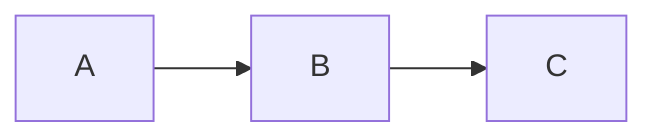

# **Markdown Cheat sheet (Second Brain)**

## 1. **Basic Text Formatting**

### Headings

Use `#` to create headings (H1 to H6):

```markdown
# H1 Heading
## H2 Heading
### H3 Heading
#### H4 Heading
##### H5 Heading
###### H6 Heading
```

### Emphasis

_Italic_ with asterisks or underscores:

```markdown
*italic* or _italic_
```

**Bold** with double asterisks or underscores:

```markdown
**bold** or __bold__
```

_**Bold and italic**_:

```markdown
***bold and italic***
```

### Strikethrough

To cross out text:

```markdown
~~strikethrough~~
```

### Code

Inline code:

```markdown
`inline code`
```

Code block (with three backticks or indentation):

Code block

````

```markdown
Or indented with four spaces:
    Code block
````

### Links

Links to websites or files:

```markdown
[Obsidian](https://obsidian.md)
```

Links to internal files (Obsidian-specific):

```markdown
[[Note Title]]
```

To link to a specific block in a note, use block references:

```markdown
[[Note Title#block-id]]
```

### Images

Embed images:

```markdown

```

## 2. **Lists**

### Unordered List

Create lists with dashes, asterisks, or plus signs:

```markdown
- Item 1
- Item 2
  - Sub-item 2.1
  - Sub-item 2.2
```

### Ordered List

Numbered list:

```markdown
1. First item
2. Second item
   1. Sub-item 2.1
   2. Sub-item 2.2
```

### Task List (Checkboxes)

Create tasks with checkboxes:

```markdown
- [ ] Task 1
- [x] Completed task
```

## 3. **Links and Backlinks**

### Internal Links

Link to other notes within Obsidian:

```markdown
[[Another Note]]
```

### Backlinks (Automatic in Obsidian)

To see all backlinks to a note, go to the right sidebar and select the "Backlinks" tab. You don't need to write anything for backlinks to show up—they appear automatically.

### Tagging

Use `#` for tags in Obsidian:

```markdown
#tagname
```

You can use multiple tags in a note:

```markdown
#project #task #idea
```

You can also use tags in specific sections for better organization:

```markdown
## Notes for #research
- Idea 1
- Idea 2
```

## 4. **Blockquotes**

For quoting text:

```markdown
> This is a blockquote.
```

### Nested Blockquote

Blockquote inside a blockquote:

```markdown
> First level
>> Second level
```

## 5. **Tables**

Create tables with pipes `|` and dashes `-`:

```markdown
| Header 1 | Header 2 | Header 3 |
|----------|----------|----------|
| Row 1, Col 1 | Row 1, Col 2 | Row 1, Col 3 |
| Row 2, Col 1 | Row 2, Col 2 | Row 2, Col 3 |
```

## 6. **Obsidian-Specific Features**

### Backlinks Pane

The **Backlinks** pane shows you all notes that link to the current note. Access it by clicking on the **Backlinks** tab in the right sidebar.

### Transclusion (Embed a Note's Content)

You can embed the entire content of another note:

```markdown
![[Another Note]]
```

### Tags Pane

Obsidian automatically collects and shows tags. You can view all the tags across your vault by opening the **Tags** pane from the left sidebar.

### Aliases

You can define alternative names (aliases) for a note using YAML front matter:

```yaml
---
aliases: [Synonym1, Synonym2]
---
```

### Dataview Plugin (for Advanced Queries)

You can use the **Dataview** plugin to query and display data from your notes. For example, listing all notes with a specific tag:

````markdown
```dataview
table name, file.mtime
from #project
sort file.mtime desc
````

````

### Linking Notes (Linking Your Thoughts)
In Obsidian, you can create **bi-directional links** between notes to simulate a "second brain." This allows you to create a network of related notes that enhances your knowledge discovery and retrieval.

For example:
```markdown
[[Idea 1]] → [[Idea 2]] → [[Idea 3]]
````

## 7. **Advanced Formatting**

### Callouts

Obsidian allows you to create **callouts** using the `!` symbol:

```markdown
> [!tip] This is a tip callout.
> 
> It can include additional information.
```

### Footnotes

To add footnotes:

```markdown
Here is a reference[^1].

[^1]: This is the footnote content.
```

### Horizontal Line

Create a horizontal line (useful for separating sections):

```markdown
---
```

### Embedding Links as Buttons

You can make clickable buttons within Obsidian:

```markdown
[Button Text](http://example.com)
```

### Mermaids Diagrams

For visualizing flowcharts or diagrams:

````markdown


## 8. **Obsidian Plugins (Optional)**
- **Calendar Plugin**: Useful for creating and viewing a daily calendar.
- **Kanban Plugin**: For creating Kanban boards.
- **Tasks Plugin**: For more advanced task management and query-based tasks in Obsidian.

```